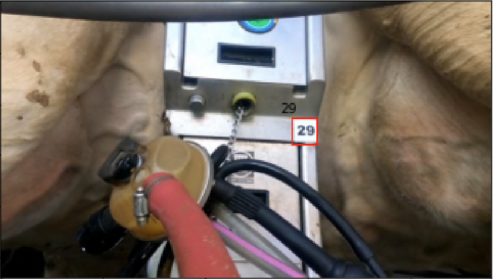

# Cow_stall_number

This directory contains the dataset of stall number recognition. 

The images are available at [this link](https://drive.google.com/file/d/11bYAS63OvNBAeeTbuuuNmb622N2JBgvx/view?usp=sharing).


If you have any questions, please email to youshan.zhang@yu.edu

In the train and test CSV files, it contains the image name, stall number box location, and its number label.


<p align="center">
   
</p>
<p align="center">Example image of stall number 29 with its box location</p>


### Reference

If you find it is helpful, please cite it as:

`
Zhang, Youshan. 2022. "Stall Number Detection for Cow Teat Videos".
`


Or in bibtex style:

```

@Article{zhang2022stall,
AUTHOR = {Zhang, Youshan},
TITLE = {Stall Number Detection for Cow Teat Videos}
}
